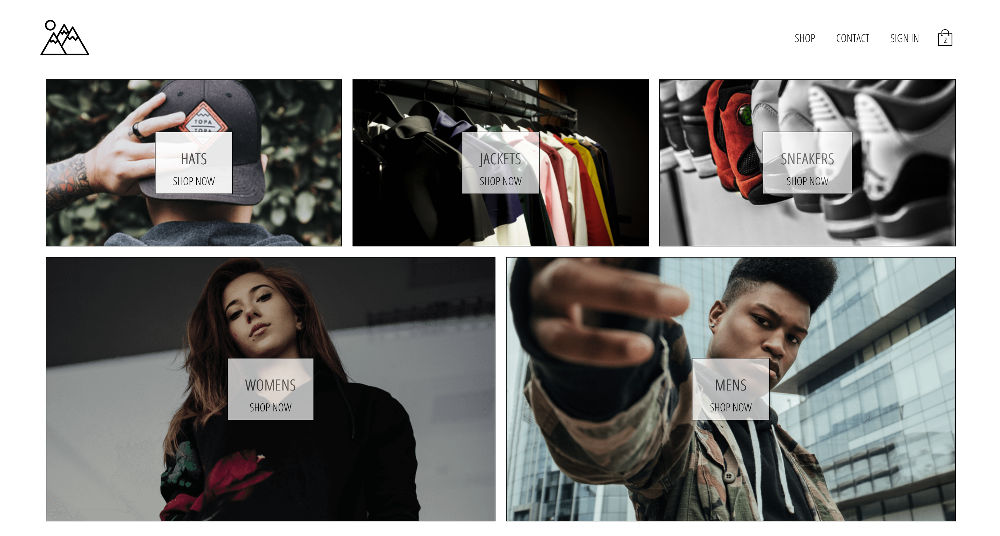
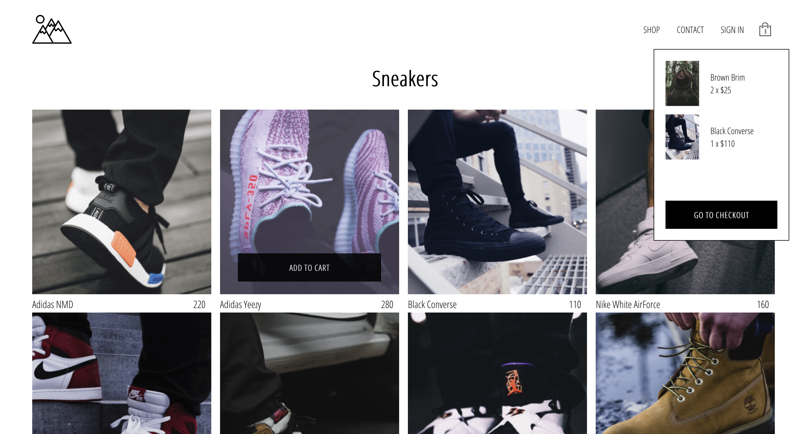
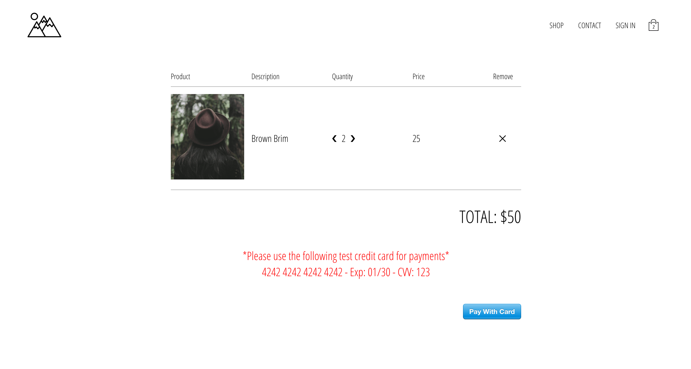
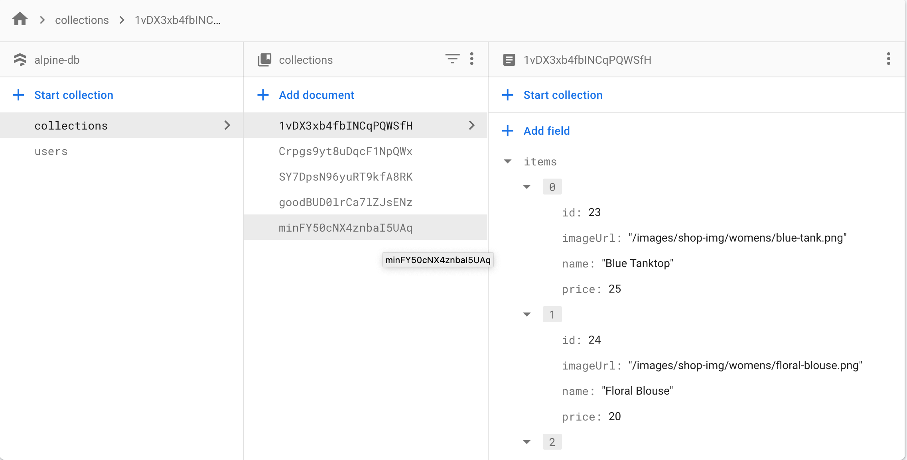

# Alpine Clothing - React E-commerce Store

Live deployment: https://alpine-clothing.vercel.app

E-commerce store for a clothing brand built using React and Firebase

Includes the main features of an ecom store:

- Home page
- Shop page
- Collection/category pages
- Checkout page

## Stack

- React
- Redux
- Reselect
- Redux-Saga
- Google OAuth for authentication
- Google Firebase for backend/database
- Stripe API for checkout (test)
- Styled-Components for styling

## Screenshots

